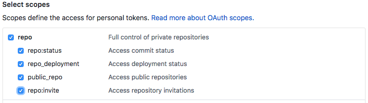

# Chronicler 

Chronicler is an open source node.js app that automates your repo's release notes.  Chronicler will listen for pull request events from GitHub Webhooks.  When a pull request is merged Chronicler will create a new release draft OR edit an existing one with the PR info.  The result is a neatly formatted release note draft listing all PRs merged since your last tagged release.

Read more in the [Times Open blog post](https://open.nytimes.com/open-source-automating-release-notes-in-github-dd08f964465c).

### How it Works
Chronicler receives GitHub Webhook events from the repository you hook it up to.  By listening for pull request events, Chronicler can watch for merged PRs and add them to release note drafts.  When a PR is merged Chronicler will either create a new release draft or edit an existing draft.  If a note draft does not already exist a new, untagged draft will be created titled `NEXT RELEASE` with the PR info as the body content.  If a draft does exist it will append the PR to it.  The draft body consists of a list of pull requests with the PR title and number:

Pull Request format
```
- PR title (#PR_Number)
```

Draft Example
```
- Adds README documentation for Chronicler (#3)
- Formats PR info for draft body (#11)
- Adds contributing guidelines (#14)
```

## Getting Started
Chronicler is a simple express.js app that receives GitHub Webhook events via its `/webhooks` route.  You'll need to clone and set the app up on a server or cloud service (e.x. Google Cloud Platform, AWS, Digital Ocean) to use it for your own projects.

### Setup

#### Environment Variables
The following variables must be set up and available to Chronicler via the node.js `process.env` object.

**Variable Name** | **Description** | **Default**
--- | --- | :---:
`GH_TOKEN` | The Github [personal access token](https://github.com/settings/tokens) to use for this app.  Used for authentication when making calls to the GitHub API. | -
`SECRET` | The GitHub Webhook secret passed along with every Webhooks request.  Allows your app to authenticate the request and make sure the request is coming from a trusted source.  Generate a [random string with high entropy](https://developer.github.com/webhooks/securing/#setting-your-secret-token) for your secure secret or create one using an online [generator](https://randomkeygen.com/). | -
`APP_NAME` (optional) | Name of the app to send as the `User-Agent` value in the API requests. | `Chronicler`
`NODE_PORT` (optional) | App port. | `8080`

##### A Note on Personal Access Tokens
Chronicler requires a personal access token (PAT) to create or edit a release draft via the GitHub API.  PATs are tied to a user's account.  For GitHub teams or organizations using Chronicler we recommend creating a dedicated GitHub account that owns the PAT.  By creating the PAT with a dedicated GitHub account instead of with a team member's account, you can avoid interruptions to Chronicler if the team member leaves or is removed from the organization.

To generate a new PAT for Chronicler, go to your [account settings](https://github.com/settings/tokens/new).  Add a "token description" (e.x "chronicler-app") and grant it `repo` scope.



If your organization enforces [SAML SSO](https://docs.github.com/en/free-pro-team@latest/github/setting-up-and-managing-organizations-and-teams/enforcing-saml-single-sign-on-for-your-organization), you'll need to enable it for the PAT on [this](https://github.com/settings/tokens) page.

#### Enabling Webhooks for your Repository
With Chronicler set up on your environment, you can now set your repo up with Webhooks.

1. From your repo page, click on the "Settings" tab.
2. On the left hand side, click the "Webhooks" menu item.
3. Click the "Add Webhook" button.
4. Add the url where your instance of Chronicler can be found with the `webhooks` path (e.x. `http://your.domain.com/webhooks`).
5. From the "Content Type" dropdown menu, select `application/json`.
6. Set the "Secret" field equal to the `SECRET` environment variable value created earlier.
7. Under "Which events would you like to trigger this webhook?" check off the "Let me select individual events" option.  This will expand the event options where you should select "Release" and "Pull Request."
8. Ensure that "Active" is checked off, and click "Add webhook" at the bottom of the form.
9. Celebrate :tada: You're now ready to start using Chronicler to automate your repository's release notes!

### Deploy to Google Cloud Functions
Cloud Functions are a cheap and easy way to run Chronicler.

To deploy from command line:
``` shell
GH_TOKEN=<SET_TOKEN_HERE>
SECRET=<SET_SECRET_HERE>
PROJECT=<SET_PROJECT_HERE>

gcloud functions deploy chronicler \
--runtime nodejs12 --trigger-http --allow-unauthenticated \
--set-env-vars GH_TOKEN="$GH_TOKEN",SECRET="$SECRET" \
--project "$PROJECT"
```

### How to contribute
Pull requests, issues, and feature requests always welcome! Read the [contributing guide](docs/CONTRIBUTING.md) for information on how to get started.
test1
test2-branch1
test3-branch3
test6-branch6
fake-feature
