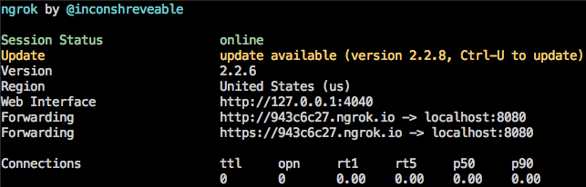

# Contributing to Chronicler
Chronicler is an open source project started by a couple of engineers at The New York Times.  Issues and Pull Requests are always welcome!

## Filing Issues
Feel free to open issues for bugs, feature requests, and general questions.

1. What version of node.js/npm are you using (`node --version` and `npm --version`) ?
2. What did you expect to see?
3. What did you see instead?

## Contributing code
Pull requests are very welcome! Before submitting changes, please follow these guidelines:

- Check the open issues and pull requests for existing discussions.
- Open an issue to discuss a new feature.
- Write/run tests and lint your code.
- Open a Pull Request.

## License
Unless otherwise noted, the Chronicler source files are distributed under the Apache 2.0-style license found in the LICENSE file.

## Local Development

### Installation
Clone the repo and install dependencies.

```bash
$  git clone https://github.com/NYTimes/Chronicler.git
$  cd Chronicler
$  npm install
```

### Setup

#### Download ngrok
To test Chronicler locally with real GitHub Webhook events you'll need to use a tunneling service that creates public URLs to your local environment.  We reccommend using [`ngrok`](https://ngrok.com/).

1. [Download ngrok](https://ngrok.com/download) and move the file to the `chronicler` directory.
2. Unzip the ngrok file `unzip ./ngrok-file-name.zip`.

#### Environment variables
There are a few environment variables that need to be set and exported.  These variables should be available from the node.js `process.env` object.

**Variable Name** | **Description** | **Default**
--- | --- | :---:
`GH_TOKEN` | The Github [personal access token](https://github.com/settings/tokens) to use for this app.  Used for authentication when making calls to the GitHub API. | -
`SECRET` | The GitHub Webhook secret passed along with every Webhooks request.  Allows your app to authenticate the request and make sure the request is coming from a trusted source.  Pick a secure secret or create one using a [generator](https://randomkeygen.com/). | -
`APP_NAME` (optional) | Name of the app to send as the `User-Agent` value in the API requests. | `Chronicler`
`PORT` (optional) | App port. | `8080`

### Running Chronicler Locally

#### Start server
To start your enviroment for local testing, you'll need to first start the express server and then ngrok.

1. Run `npm run dev`.
2. Run `./ngrok http :port_number:` with the `port_number` matching the one you set as the `PORT` environment variable or `8080` if none was specified.

    ```bash
    $  ./ngrok http 8080
    ```
3. If everything is set up correctly, your node server should be running, and you should see the ngrok console up and running in the window.

4. Make note of the ngrok "Forwarding" address (e.x `https://943c6c27.ngrok.io`) displayed in the console. You'll be using this to set up the Webhook in the repo settings.

**NOTE** The ngrok "Forwarding" address changes everytime ngrok is started, so you'll need to update it in the repo webhook settings every time you stop/start ngrok.

#### Repository Webhook Settings
With your local development environment ready, you can now set your repo up with the Webhook information needed to communicate with the local environment.

1. From your repo page, click on the "Settings" tab.
2. On the left hand side, click the "Webhooks" menu item.
3. Click the "Add Webhook" button.
4. Add the ngrok "Forwarding" address to the "Payload URL" field with the `/webhooks` path (e.x. `http://943c6c27.ngrok.io/webhooks`).
5. From the "Content Type" dropdown menu, select `application/json`.
6. Set the "Secret" field equal to the `SECRET` environment variable value created earlier.
7. Under "Which events would you like to trigger this webhook?" check off the "Let me select individual events."  This will expand the event options and you should select "Release" and "Pull Request."
8. Ensure that "Active" is checked off, and click "Add webhook" at the bottom of the form.
9. Celebrate :clap: :clap: :clap: You're now ready to start developing and testing your changes locally.

#### Testing Locally
Anytime a pull request is merged in the repository you set up with your local version of Chronicler a webhook event will be sent to the ngrok endpoint provided.  To test that your changes work as expected you should run through the following cases.

**Use Case** | **Expected Outcome**
--- | ---
No release note drafts exist and a pull request is merged | A new release note draft is created that contains the merged pull request title and PR number.  The release note draft should have the title "NEXT RELEASE."
A release note draft already exists and a pull request is merged | The merged release draft title and PR number are appended to the existing release note draft as an additional list item.

#### Tests and Linting
Chronicler uses the git hooks via the [`husky`](https://github.com/typicode/husky/tree/v0.14.3) package to run tests and lint code before each commit.  When making changes to the Chronicler codebase please make sure to lint and write tests against your work.
